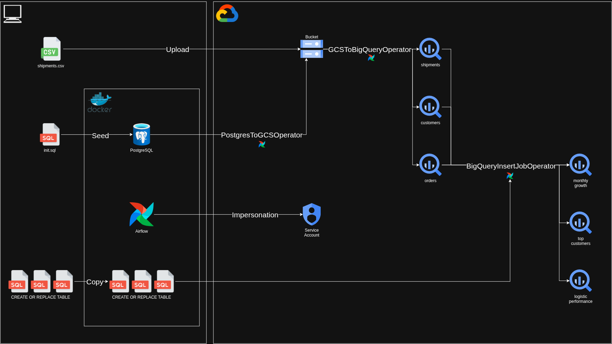

# Demo Airflow y GCP - Falabella


Esta es una demo de Airflow y GCP diseñada para ejecutarse en un entorno local usando Docker, parte de una prueba técnica de Falabella.

# Diagrama de arquitectura



# Requisitos

Para poder ejecutar la demo se requiere:

- Docker Desktop (con daemon activo)
- Un proyecto GCP con un bucket de Cloud Storage y un dataset de BigQuery creados
- Una cuenta de servicio con los permisos necesarios (ver [guía de impersonation](docs/GCP_IMPERSONATION_SETUP.md))
- Archivos generados por `init_script/desafio.py`
    - init.sql en la carpeta init_sql
    - shipments.csv subido al bucket
    - El repo incluye un ejemplo de estos archivos
- Entorno con las siguientes variables definidas

```
AIRFLOW_IMAGE_NAME=apache/airflow:3.3.1
AIRFLOW_UID=id_de_usuario
FERNET_KEY=llave_fernet

GCP_PROJECT_ID=project-123
GCP_IMPERSONATION_SA=airflow-bq@project-123.iam.gserviceaccount.com
GCS_BUCKET=nombre_del_bucket
GCP_ADC_PATH=path_de_application_default_credentials.json
BQ_DATASET=nombre_de_dataset
BQ_LOCATION=US
GCS_SHIPMENTS_OBJECT=path_de_shipments_en_bucket
```

Una vez cumplidos todos los requisitos, ejecutar `docker compose up -d` debería levantar y configurar los contenedores apropiadamente.

# DAGs

Se puede acceder a la UI de Airflow en http://localhost:8080/. Existirán 3 DAGs ya creados:

- bq_impersonation_smoke_test: una prueba para verificar la conexión con GCP
- ingest_to_bigquery: proceso de ingesta de datos a BigQuery
- bq_transformations: proceso para generar tablas analíticas a partir de la ingesta, utiliza las queries de la carpeta `dags/sql`

# Notas

- El archivo `docker-compose.yaml` es el ejemplo provisto por Airflow en https://airflow.apache.org/docs/apache-airflow/stable/howto/docker-compose/index.html, con ligeros ajustes para los propósitos de esta demo
- Por simplicidad se han dejado credenciales de Postgres y Airflow expuestas; se reservaron las variables de entorno para parámetros específicos de GCP y lo mínimo que pide Airflow para funcionar